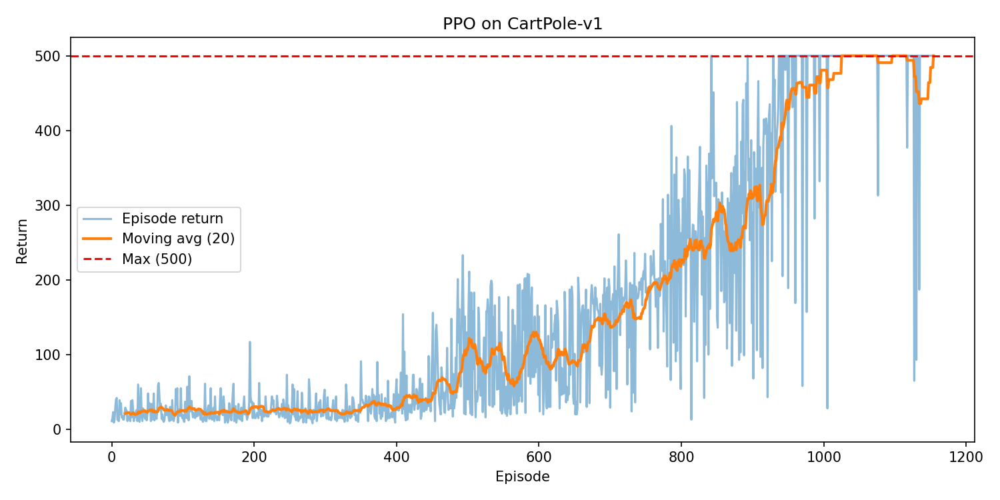

# PPO on CartPole-v1

Proximal Policy Optimization (**PPO (Proximal Policy Optimization: a clipped policy-gradient method)**) for **CartPole-v1** using an **actor-critic (actor: policy \(\pi(a|s)\), critic: value \(V(s)\))** model and **GAE (Generalized Advantage Estimation: a variance-reduction method for advantage estimates)**.

## Environment

- **State (observation)**: `[cart_pos, cart_vel, pole_angle, pole_angular_vel]` (4 floats)
- **Actions**: `{0: push left, 1: push right}` (2 discrete actions)
- **Reward**: +1 per timestep balanced (max episode return **500**)

## Method (PPO)

- Actor outputs action distribution \(\pi_\theta(a|s)\), critic predicts \(V(s)\).
- Advantages computed with **GAE**.
- Policy updated with the **clipped PPO objective** to prevent overly-large updates.

Network: shared MLP `4 → 128 → 128` (ReLU), with:
- actor head → 2 logits
- critic head → 1 value

Defaults: `lr=3e-4`, `gamma=0.99`, `gae_lambda=0.95`, `clip_ratio=0.2`, `n_steps=2048`.

## Install

```bash
pip install -r requirements.txt
```

## Run

Train:

```bash
python train.py
```

Evaluate (greedy argmax policy):

```bash
python evaluate.py
```

## Outputs

Training writes to `results/`:
- `trained_model.pt`
- `episode_rewards.json`
- `learning_curve_ppo.png`
- `vs_dqn_comparison.png`

## Results

From `results/episode_rewards.json`:

- **Total timesteps**: **200,000**  
- **Approx. environment steps** (sum of episode returns): **199,640**  
- **Best episode return**: **500 / 500**  
- **Mean return (last 10 episodes)**: **500.0 / 500**  
- **Mean return (last 50 episodes)**: **474.4 / 500**

This run achieves the maximum return repeatedly and reaches near the common “solved” threshold (moving average return ≥ **475**).

## Plots



